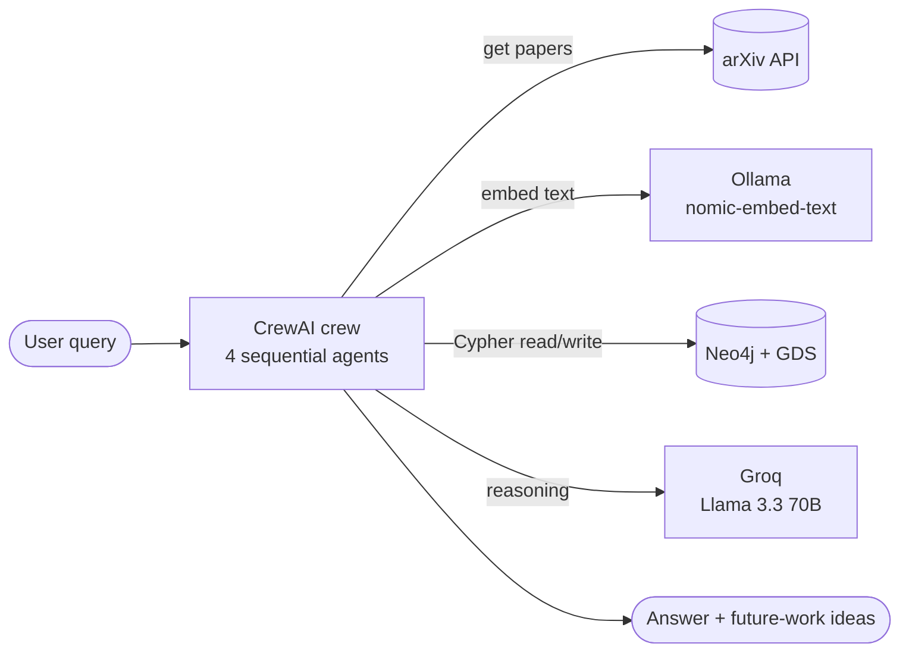

# Academic Research Paper Assistant — Agentic GraphRAG 🧠📚

> A four-agent **CrewAI** pipeline that pulls papers from **arXiv**, stores them as a **Neo4j** graph with vector embeddings, and answers research questions using text retrieved from that graph.

## The problem

A literature review means finding papers, reading them, and pulling out what matters. That takes a lot of manual work. This project automates the first pass: give it a question and it will:

1. Find recent papers on the topic.
2. Store and index them.
3. Write an answer from passages it retrieves from them.
4. Suggest future research directions.

## Key capabilities

| | Capability | How |
|---|---|---|
| 📥 | **Ingest** | arXiv search → PDF download → text chunking |
| 🕸️ | **Graph storage** | `Author -[:WROTE]-> SummaryNode <-[:BELONGS_TO]- TextChunk` in Neo4j |
| 🔎 | **Semantic retrieval** | Ollama `nomic-embed-text` embeddings + cosine similarity in Cypher (Neo4j GDS) |
| 🤖 | **Multi-agent reasoning** | 4 CrewAI agents run one after another: search → database lookup → Q&A → future work |
| ⚡ | **LLM** | `llama-3.3-70b-versatile` served by **Groq** |

## Architecture at a glance



## Tech stack

`Python 3.10` · `CrewAI` · `LangChain` (loaders, splitters, Ollama/Groq integrations) · `Ollama` · `Groq` · `Neo4j` + Graph Data Science · `arxiv` · `PyMuPDF` · Jupyter

## Quick start

```bash
pip install -r requirements.txt
pip install langchain langchain-community langchain-ollama langchain-groq pytz   # imported but not in requirements.txt

ollama pull nomic-embed-text                                   # local embedding model
docker run -d --name neo4j -p 7474:7474 -p 7687:7687 \
  -e NEO4J_AUTH=neo4j/password \
  -e NEO4J_PLUGINS='["graph-data-science"]' neo4j:5            # GDS is required

cp .env_example .env    # fill in the Neo4j settings and GROQ_API_KEY
jupyter notebook project.ipynb   # run all cells
```

> [!WARNING]
> The notebook currently sets the Groq API key directly in code (the `llm = LLM(...)` cell). Replace it with your own key, or load it from `.env`, before running. See [development guide → Configuration](docs/development.md#configuration).

## 📖 Documentation

| Read this | If you have |
|---|---|
| [**docs/index.md**](docs/index.md): mental model, main flow, components, decisions | 2–10 minutes |
| [**docs/architecture.md**](docs/architecture.md): data model, lifecycle, failures, scaling | a deep dive |
| [**docs/development.md**](docs/development.md): setup, config, tools API, debugging | hands on the code |
