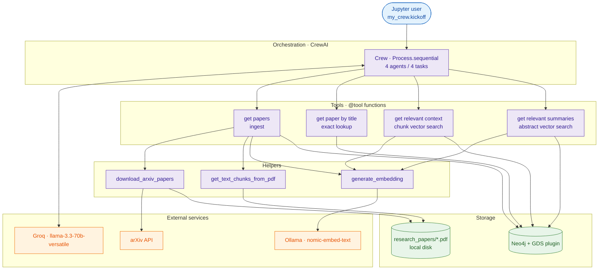
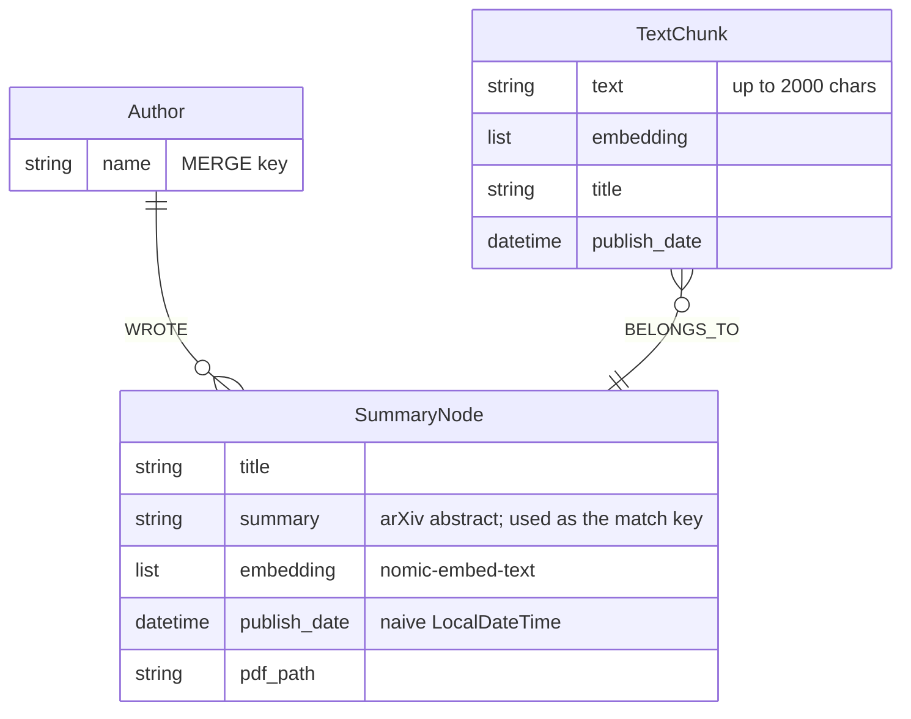
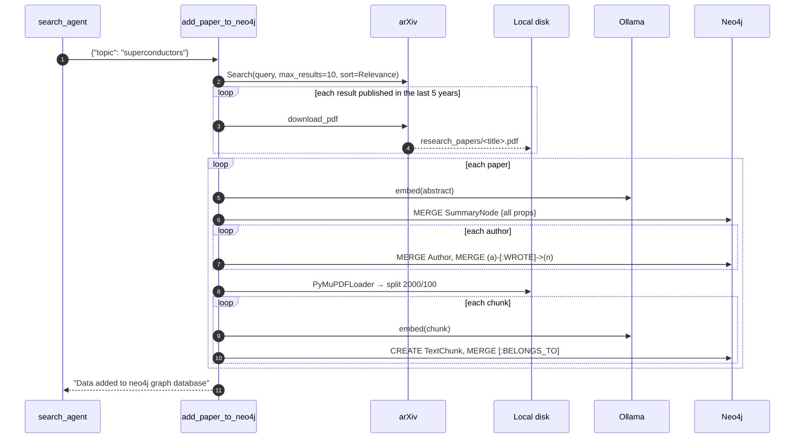
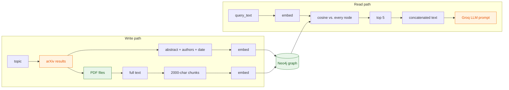
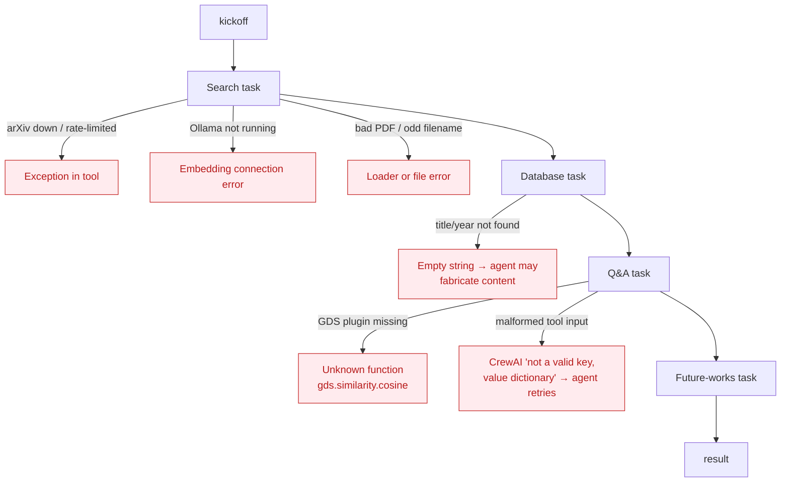

# Architecture

> Assumes you've read [index.md](index.md), which covers the crew-level flow.
> This page goes one level down: layers, the graph data model, the ingest and retrieval internals, failure points, and scaling.

---

## High-Level Architecture

## Component Responsibilities

| Layer | Component | Owns | Doesn't do |
|---|---|---|---|
| Orchestration | `my_crew` | Task order; passes each task's output to the next | Parallelism; validating agent output |
| Agents | `search_agent` | Decides the topic string for ingest | Answering |
| | `database_agent` | Exact paper lookup (`allow_delegation=True`) | Vector search (see note below) |
| | `question_answer_agent` | Final answer from top-k chunks | Seeing `{user_query}` directly |
| | `future_works_agent` | Research-gap suggestions | Adding new data |
| Tools | `add_paper_to_neo4j` | All graph writes | Deduplicating chunks |
| | `get_text_chunk_nodes_by_title_and_year` | Read-only lookup by exact title + year | Fuzzy matching |
| | `get_relevant_context` / `vector_search_summaries` | Embed query → cosine rank → concatenate text | Returning scores or metadata to the agent |
| Helpers | `download_arxiv_papers` | arXiv search, 5-year filter, PDF download | Retries or rate limiting |

> [!NOTE]
> `query_database_task` sets `tools=[vector_search_summaries]`, while `database_agent` has `tools=[get_text_chunk_nodes_by_title_and_year]`. In the recorded run the agent only called **`get paper by title`**. How CrewAI resolves task tools vs. agent tools in the installed version is **NEEDS VERIFICATION**.

## Graph Data Model

- **`summary` is the effective primary key.** Author and chunk writes find their paper with `MATCH (n:SummaryNode {summary: $summary_text})`.
- There are **no constraints or indexes** anywhere in the repo, including vector indexes.

## Request Lifecycle — `get papers` (ingest)

This is the heaviest request in the system. It runs as a single tool call inside the search task.

> Every step here is **synchronous and serial**: one HTTP call to Ollama and one Cypher statement per chunk.

## Data Flow

## State Management

| State | Lives in | Changes when | Persistent? |
|---|---|---|---|
| Papers, authors, chunks, embeddings | Neo4j (`NEO4J_DATABASE`) | Each `get papers` call | ✅ Across runs, and it **accumulates** |
| PDF files | `./research_papers/` | Each download; same title → overwritten | ✅ |
| Neo4j driver, `llm`, agents, tasks | Notebook kernel globals | Cell execution | ❌ Lost on kernel restart |
| Inter-task context | CrewAI's in-memory task outputs | Each task completes | ❌ Per `kickoff` |
| Config | `.env` → `os.getenv` | Kernel start (`override=True`) | File-based |

**Persistence boundary:** only Neo4j and the PDF folder survive a run. The final answer is returned as `result` and is not saved anywhere.

## Async / Event Flow

Not applicable. The code has no async calls, queues, background workers, or event handlers; everything runs sequentially in the notebook kernel. The only "events" are CrewAI's verbose logs printed to stdout.

## Failure Boundaries

| Boundary | Handling in code | Observed? |
|---|---|---|
| arXiv / Ollama / Neo4j errors | None (no try/except). Only `max_retries=3` on the search task | Not observed |
| Tool input parsing | CrewAI returns an error to the agent, and the agent tries again | ✅ Cell 54 output |
| Empty retrieval | Tool returns `""`; nothing prevents fabrication | ✅ Cell 54: invented "John Doe" paper |
| Partial ingest | No transaction around a paper; a failure mid-loop leaves a partial graph | Inferred from code |

## Scaling Model

**Current model:** one process, one notebook, serial I/O, and a single Neo4j instance.

| Bottleneck | Why | At 10× load (≈100 papers/run, 10× graph) | What would need to change |
|---|---|---|---|
| Ingest time | One Ollama call and one Cypher write per chunk, all in series | Grows roughly linearly with the number of chunks | Batch embeddings; `UNWIND` batched writes; parallel downloads |
| Vector search | `MATCH (t:TextChunk)` + GDS cosine = full scan | Query cost grows linearly with the number of chunks | Neo4j vector index (`db.index.vector.queryNodes`) |
| Duplicate chunks | `CREATE` on each run | Graph grows with every re-run of a topic | `MERGE` on a chunk hash, or uniqueness constraints |
| LLM context | Top-5 × 2000 chars sent to Groq in each tool call | Stays constant per query, but more agents means more tokens | Re-ranking; summarizing context first |
| Groq rate limits | Hosted API | **UNKNOWN / NEEDS VERIFICATION** (depends on plan) | Backoff, caching, or a local model (an Ollama LLM is already stubbed in cell 30) |

No benchmarks exist in the repository.

## Architecture Decisions

| Decision | Why | Tradeoff | Evidence |
|---|---|---|---|
| **GraphRAG on Neo4j** instead of a standalone vector DB | Keeps relationships (author ↔ paper ↔ chunk) and vectors together | Brute-force similarity; GDS plugin needed | Cells 12, 19, 22 |
| **Embeddings as node properties** + GDS cosine | No index setup; works on any GDS-enabled instance | Linear scan per query | `gds.similarity.cosine(t.embedding, $query_embedding)` |
| **Groq-hosted Llama 3.3 70B** | Large model, fast inference; `llama-3.1-70b-versatile` in the copy notebook suggests a model upgrade | External dependency; hard-coded key | Cell 29; `project_copy.ipynb` |
| **Local Ollama embeddings** | Free, private embedding step | Ollama must be running locally | Cell 4 |
| **Sequential crew** | Deterministic order: store → look up → answer → extend | No parallel steps; errors carry forward | Cell 53 `Process.sequential` |
| **Abstract as the node key** | arXiv provides no other ID in the stored fields | Fragile; an arXiv entry ID would be sturdier | `MATCH (n:SummaryNode {summary: ...})` |
| **Ollama as an alternative LLM** (commented out) | Option to run fully local | Not active | Cell 30 |
