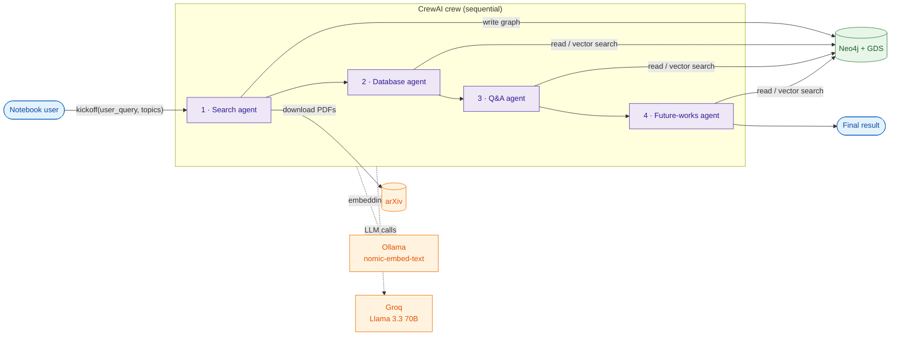
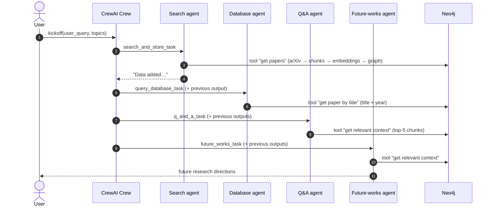

# Academic Research Paper Assistant

> ⏱️ **2-minute read:** *What is this?*, *System in One Diagram*, and *How It Works*.
> ⏱️ **10-minute read:** add *Components*, *Decisions*, and *Limitations*.
> 🔬 **Deep dive:** [architecture.md](architecture.md) → [development.md](development.md).

---

## What is this?

A **multi-agent research assistant** built as a single Jupyter notebook ([`project.ipynb`](../project.ipynb)).

- You pass in a question, e.g. *"What is currently going on in the field of superconductors?"*
- A **CrewAI** crew downloads matching arXiv papers.
- It stores them in **Neo4j** as a small knowledge graph: papers, authors, and embedded text chunks.
- Agents then answer the question and suggest future research directions, using text retrieved from that graph by **vector similarity**.

## Project at a Glance

| Area | Technology / Approach |
|---|---|
| Form factor | Jupyter notebook; no app, API server, or UI |
| Orchestration | CrewAI `Crew` with `Process.sequential`: 4 agents, 4 tasks |
| LLM | `groq/llama-3.3-70b-versatile` via `crewai.LLM` |
| Embeddings | Ollama `nomic-embed-text` (runs locally) |
| Paper source | `arxiv` Python client |
| PDF parsing | LangChain `PyMuPDFLoader` + `RecursiveCharacterTextSplitter` |
| Storage | Neo4j: graph nodes with embeddings stored as node properties |
| Similarity | `gds.similarity.cosine(...)` in Cypher; needs the Neo4j **Graph Data Science** plugin |
| Config | `.env` loaded with `python-dotenv` |

## System in One Diagram

## How It Works

1. **Kickoff.** `my_crew.kickoff(inputs={'user_query': ..., 'topics': ...})`. These values fill `{user_query}` in the search agent's goal and `{topics}` in the database agent's goal.
2. **Search and store.** The search agent calls **`get papers`**. It queries arXiv for **10** papers by relevance and keeps only those published in the last **5 years**. It then downloads each PDF to `research_papers/`.
3. **Embed and graph.** Each paper's abstract becomes a `SummaryNode`. Each PDF is split into **2000-char chunks** (100 overlap), and each chunk becomes a `TextChunk`. Abstracts and chunks are all embedded with Ollama.
4. **Database lookup.** The database agent looks up chunks by exact **title + year**.
5. **Answer.** The Q&A agent embeds a query string, ranks all `TextChunk` nodes by cosine similarity, and uses the **top 5** as context.
6. **Future work.** The future-works agent repeats that retrieval and suggests research directions.
7. **Output.** Because the process is sequential, each task's output is passed to the next task. The crew returns the last task's output.

## Important Components

All code lives in `project.ipynb`. Cell numbers are 0-based.

| Component | Responsibility | Important Code |
|---|---|---|
| `download_arxiv_papers` | Search arXiv, filter by date, download PDFs, return metadata | cell 3 |
| `generate_embedding` | Ollama `nomic-embed-text` → vector | cell 4 (duplicated in 5) |
| `get_text_chunks_from_pdf` | PyMuPDF load → recursive split | cell 9 |
| 🛠️ `get papers` tool | Ingest pipeline: arXiv → Neo4j nodes and relationships | `add_paper_to_neo4j`, cell 12 |
| 🛠️ `get paper by title` tool | Fetch every chunk of one paper by exact title + year | cell 13 |
| 🛠️ `get relevant context` tool | Top-5 `TextChunk` by cosine similarity | cell 19 |
| 🛠️ `get relevant summaries` tool | Top-5 `SummaryNode` by cosine similarity | cell 22 |
| Agents | `search_agent`, `database_agent`, `question_answer_agent`, `future_works_agent` | cells 32–38 |
| Tasks + Crew | 4 tasks wired into `my_crew` (sequential) | cells 41–53 |

## Key Technical Decisions

| Decision | Why | Tradeoff |
|---|---|---|
| Neo4j stores **both** the graph and the vectors | One store for relationships (authors, paper → chunk) and similarity search | Similarity is a full scan with `gds.similarity.cosine`; no vector index is used |
| Two retrieval levels (abstract vs. chunk) | Coarse paper-level vs. fine passage-level context | Only chunk-level retrieval is shown being called in the recorded run |
| Local embeddings (Ollama) + hosted LLM (Groq) | Embedding is free and local; 70B inference is fast on Groq | Two runtimes to set up; embedding throughput depends on the local machine |
| Sequential CrewAI process | Simple, predictable pipeline; each step sees earlier outputs | No parallelism; one bad step affects every step after it |
| Ingest is an **agent tool**, not a separate job | The whole flow is a single `kickoff` | Every run re-downloads and re-embeds papers (see limitations) |

## Important Numbers

Configured in code. There are no measured metrics.

| Parameter | Value | Where |
|---|---|---|
| Agents / tasks / tools | 4 / 4 / 4 | cells 12–53 |
| Papers fetched per run | ≤ 10 (`max_results`) | cell 3 |
| Recency window | 5 × 365 days | cell 3 |
| Chunk size / overlap | 2000 / 100 characters | cell 9 |
| Retrieval `top_k` | 5 | cells 19, 22 |
| Task retries (search task) | `max_retries=3`. `retry_delay=10` is also passed; its effect in CrewAI is **NEEDS VERIFICATION** | cell 41 |

> [!NOTE]
> Latency, throughput, graph size, and answer accuracy have **not** been measured. The earlier README claimed "40–50% time savings" and "hundreds of papers". Neither is supported by the repository: **UNKNOWN / NEEDS VERIFICATION**.

## Known Limitations

- ⚠️ **Hallucination is not prevented.** In the saved run (cell 54 output), `get paper by title` returned nothing. The database agent then made up a paper ("Recent Advances in Superconductors", authors "John Doe, Jane Smith"), and that invented text ended up in the Q&A answer.
- 🔑 **API key in source.** A Groq key is hard-coded in the LLM cell of both notebooks. `GROQ_API_KEY` in `.env` is never read.
- 🧩 **The user's question never reaches the later agents directly.** `{user_query}` appears only in the search agent's goal, and the Q&A agent's trace says *"The user's query is not explicitly stated"*.
- 🔁 **Duplicate chunks on re-run.** `TextChunk` nodes are written with `CREATE`, so they are added again each run. `SummaryNode` uses `MERGE`, so it is not.
- 🐢 **Brute-force similarity.** Every `TextChunk` is scored on every query.
- 📦 **`requirements.txt` doesn't match the imports.** Several LangChain packages and `pytz` are missing. Google API, FastAPI, Streamlit, and DuckDuckGo packages are listed but never used.
- 📓 **Notebook only.** No tests, no packaging, no API or UI.

## Where To Go Next

- 🏗️ [**Architecture**](architecture.md): graph data model, request lifecycle, failure boundaries, scaling
- 🛠️ [**Development guide**](development.md): setup, environment variables, tool reference, debugging
